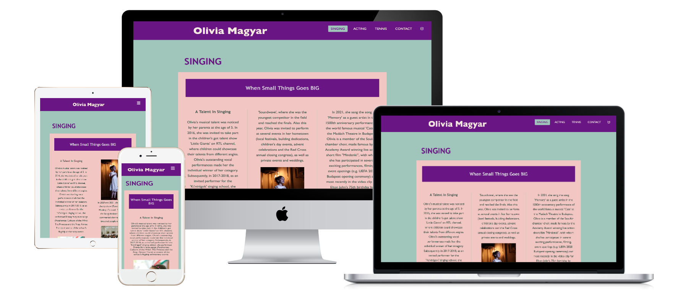
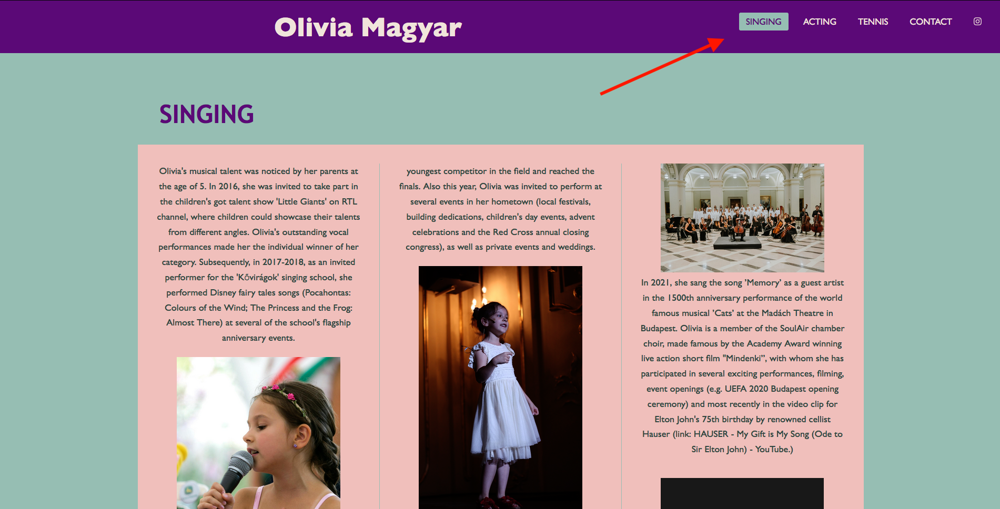
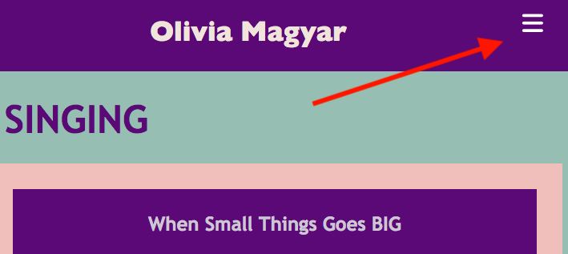
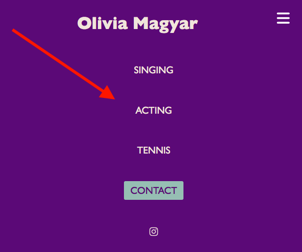
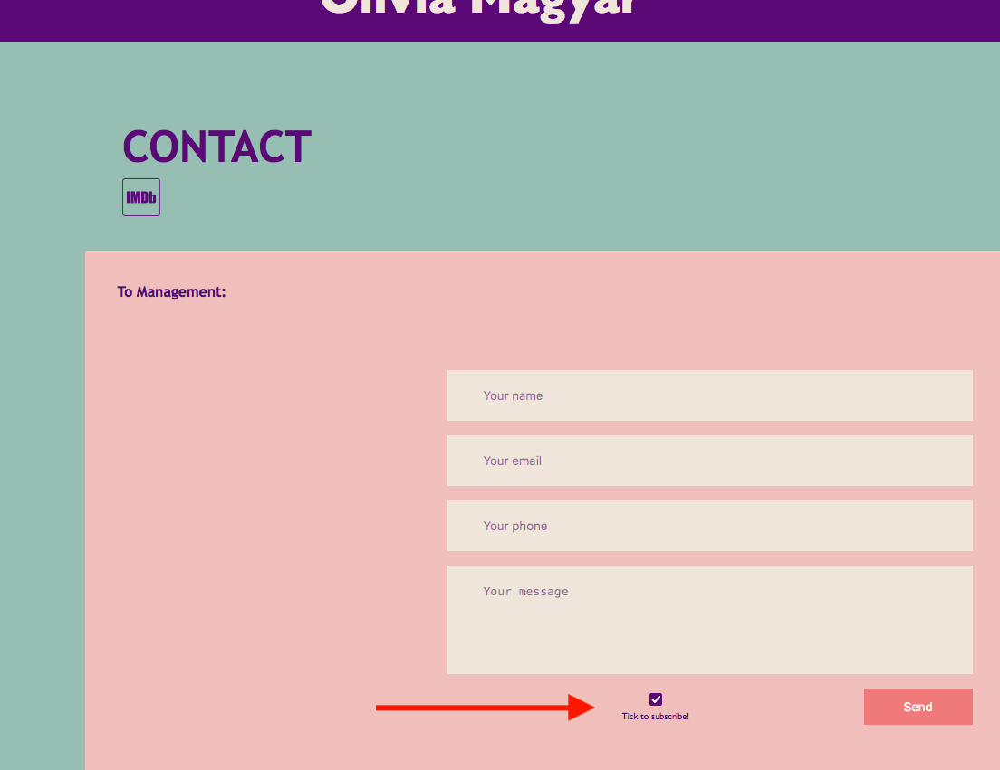
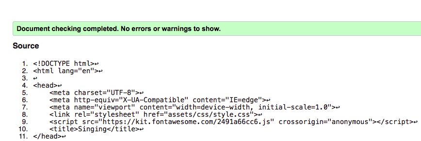
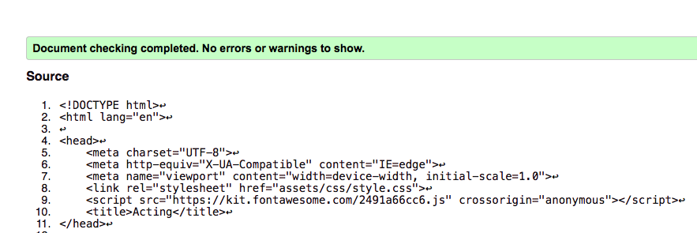
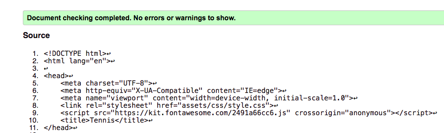
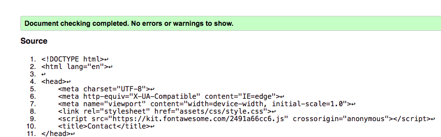
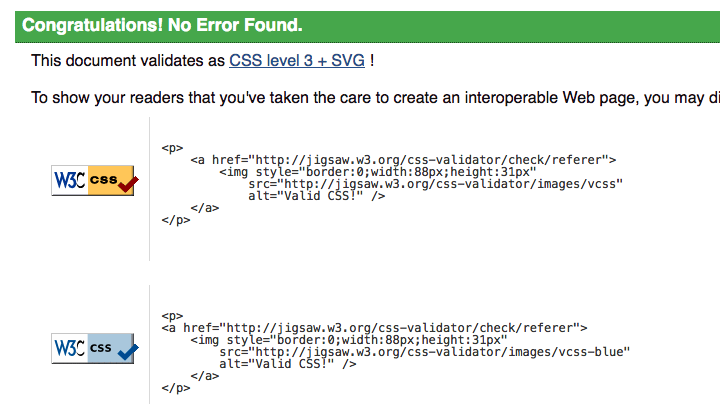

# Olivia Magyars Website
## A website for a rising star

 

&nbsp;

Olivia Magyars website is a key site to bring her talents to the crowd and help the audience and producers to find a way to contact her maagement. 

Click [here](https://sandorgyorfi.github.io/Milestone1_CI/) to visit the live page.

&nbsp;

# Features 

&nbsp;

 There’s three menu points in each talents telling a story how she’s made it up to the celebrities in a ridiculously young age. There’s also a contact menu to make the communication easier

 
&nbsp;

## Existing Features

&nbsp;

# User Experience

Click [here](assets/images/wireframes.png) to visit the wireframe sample.

* All users and fans who liked to read some news about Olivias carrier or just would like to contact her management can do it an easy way with this website. 

&nbsp;

### Navigation Bar:

&nbsp;

  - Featured on all four pages, the full responsive navigation bar includes links to the Singing, Acting and Tennis menus and is identical in each page to allow for easy navigation. Theres also social media links inside the nav bar.
  - This section will allow the user to easily navigate from page to page across all devices without having to revert back to the previous page via the ‘back’ button.
  
&nbsp;

  ### Desktop Navigation view
  
&nbsp;

  
  
  
  
&nbsp;

  ### Transition To Hamburger Menu Automatically _(when changes accured in the page size)_

  
&nbsp;

  

  
&nbsp;

  ### And Transitioning The Menu

  
&nbsp;

  

  
&nbsp;

- __The pages__

  - The pages includes a photographs, videos, texts and external links  
  - This section introduces Olivia Magyars activity to the user

  
&nbsp;

- __Contact section__

  - The contact section will allow the user to contact with Olivia Magyars management and also give a possibility to subscribe with a check button

  
&nbsp;

 

 
&nbsp;

# The Footer

  - The footer section includes that the 100% of the website content is all right reserved.
 - Also mention the designer initials

 
&nbsp;

# Testing

&nbsp;

The website was tested on all standard device settings and all type of standard browsers as well.

It is a fully responsive and automated website and it’s catching up with all standard different sizes.

The website also been tested for deceptive persons, to make the visibility 100% 

&nbsp;

## Validator Testing

&nbsp;

### HTML:

&nbsp;

 No errors were found when passing through the official (http://validator.w3.org/services)

 
&nbsp;

### Singing Page HTML Validation:

&nbsp;

&nbsp;

### Acting Page HTML Validation:

&nbsp;

&nbsp;

### Tennis Page HTML Validation:

&nbsp;

&nbsp;

### Contact Page HTML Validation:

&nbsp;

&nbsp;

### CSS:

  - Also no errors returned when passing through the official (http://validator.w3.org/services)

&nbsp;

&nbsp;

# Deployment

 - The site was deployed to GitHub pages through GitHub Desktop from VS Code. 
 * Commit created via GitHub Desktop
 * Pushed to origin via GitHub Desktop
 * checked on GitHub pages

 - Link can be found here:
 https://sandorgyorfi.github.io/Milestone1_CI/

 
&nbsp;

## Future Features

  * A new menu will be coded and it is going to be a blog integrated to social media platforms.
  * Also there will be a sub menu at the Singing page and Contact page. There will be an event and tickets system to provide cross marketing options with partners.
  * Merchandise shop will follow around summer time

 
&nbsp;

 ## Languages used 
 
&nbsp;

 * [HTML5](https://en.wikipedia.org/wiki/HTML)
 * [CSS](https://en.wikipedia.org/wiki/CSS)

 
&nbsp;

 # Credits

 - For all the contents handled to me by Olivia Magyars legal guardian and permission recieved by them as well. 

  ## Pictures:
  [Hauser picture](assets/images/hauser01.jpg) - All the legal rights owned by Hauser https://hauserofficial.com/, permission to use recieved.

  [TV series picture](assets/images/mintaapak_s2_feed.jpg) - All the legal rights owned by TV2 Hungary https://tv2csoport.hu/about_us, permission to use recieved.

  [TV series picture](assets/images/mintaapak_s3_feed.jpg) - All the legal rights owned by TV2 Hungary https://tv2csoport.hu/about_us, permission to use recieved.

  [Olivia singing picture](assets/images/egyeb02.jpg) - All the legal rights owned by the parents, permission to use recieved.

  [Olivia singing picture](assets/images/koviragok_fellepes02.jpg) - All the legal rights owned by the parents, permission to use recieved.

  [Olivia tennis picture](assets/images/tennis02.jpeg) - All the legal rights owned by the legal guardian, permission to use recieved.

  [Olivia tennis picture](assets/images/ommain.jpeg) - All the legal rights owned by the legal guardian, permission to use recieved.

  [Olivia singing picture](assets/images/tennis01.jpeg) - All the legal rights owned by legal guardian, permission to use recieved.

## Videos:
  [Hauser video](https://www.youtube.com/embed/UTSfLE-LfPo) - All the legal rights owned by Hauser https://hauserofficial.com/, permission to use recieved.

  [Advertise video](https://www.youtube.com/embed/J6ybJtg1oyI) - All the legal rights owned by Richter Gedeon Nyrt. https://www.gedeonrichter.com/en/, permission to use recieved.

  [Fairy Tale video](https://www.youtube.com/embed/7IKgzsh3aJQ) - All the legal rights owned by Médiaszolgáltatás-támogató és Vagyonkezelő Alap. https://mtva.hu/, permission to use recieved.

&nbsp;

# Content:
- All the content written by the legal guardian. All the colour themes written by order and all the codes written by Sandor Gyorfi

