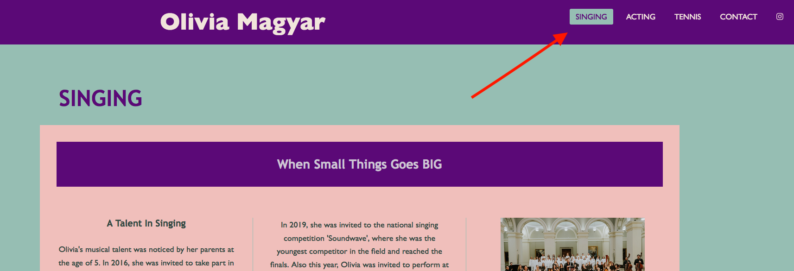

# Olivia Magyar
Olivia Magyars website is a key site to bring her talents to the crowd and help the audience and producers to find a way to contact her. 

## Features 
 There’s three menu points in each talents telling a story how she’s made it up to the celebrities in a ridiculously young age. There’s also a contact menu to make the communication easier

### Existing Features

- __Navigation Bar__

  - Featured on all three pages, the full responsive navigation bar includes links to the Singing, Acting and Tennis menus and is identical in each page to allow for easy navigation. Theres also social media links inside the nav bar.
  - This section will allow the user to easily navigate from page to page across all devices without having to revert back to the previous page via the ‘back’ button. 

   
  
  

- __The pages__

  - The pages includes a photographs, videos, texts and external links  
  - This section introduces the user to Olivia Magyars activity

-__Contact section__

 - The contact section will allow the user to contact with Olivia Magyars management and also give a possibility to subscribe with a check button

 

- __The Footer__ 

  - The footer section includes that the 100% of the website content is all right reserved.
 - Also mention the designer initials

## Testing

The website was tested on all standard device settings and all type of standard browsers as well.

It is a fully responsive and automated website and it’s catching up with all standard different sizes.

The website also been tested for deceptive persons, to make the visibility 100% 

### Validator Testing

- HTML

 No errors were found when passing through the official (http://validator.w3.org/services)

- CSS

Also no errors returned when passing through the official (http://validator.w3.org/services)

## Deployment

 - The site was deployed to GitHub pages through GitHub Desktop from VS Code. 
 * Commit created via GitHub Desktop
 * Pushed to origin via GitHub Desktop
 * checked on GitHub pages

 - Linke can be found here:
 https://sandorgyorfi.github.io/Milestone1_CI/

 ## Credits

 - For all the contents handled to me by Olivia Magyars parents and permission recieved by them as well. 

### Pictures:
  [Hauser picture](assets/images/hauser01.jpg) - All the legal rights owned by Hauser https://hauserofficial.com/, permission to use recieved.

  [TV series picture](assets/images/mintaapak_s2_feed.jpg) - All the legal rights owned by TV2 Hungary https://tv2csoport.hu/about_us, permission to use recieved.

  [TV series picture](assets/images/mintaapak_s3_feed.jpg) - All the legal rights owned by TV2 Hungary https://tv2csoport.hu/about_us, permission to use recieved.

  [Olivia singing picture](assets/images/egyeb02.jpg) - All the legal rights owned by the parents, permission to use recieved.

  [Olivia singing picture](assets/images/koviragok_fellepes02.jpg) - All the legal rights owned by the parents, permission to use recieved.

  [Olivia tennis picture](assets/images/tennis02.jpeg) - All the legal rights owned by the parents, permission to use recieved.

  [Olivia tennis picture](assets/images/ommain.jpeg) - All the legal rights owned by the parents, permission to use recieved.

  [Olivia singing picture](assets/images/tennis01.jpeg) - All the legal rights owned by the parents, permission to use recieved.

### Videos:
  [Hauser video](https://www.youtube.com/embed/UTSfLE-LfPo) - All the legal rights owned by Hauser https://hauserofficial.com/, permission to use recieved.

  [Advertise video](https://www.youtube.com/embed/J6ybJtg1oyI) - All the legal rights owned by Richter Gedeon Nyrt. https://www.gedeonrichter.com/en/, permission to use recieved.

  [Fairy Tale video](https://www.youtube.com/embed/7IKgzsh3aJQ) - All the legal rights owned by Médiaszolgáltatás-támogató és Vagyonkezelő Alap. https://mtva.hu/, permission to use recieved.

## Content:
- All the content written by the parents.

